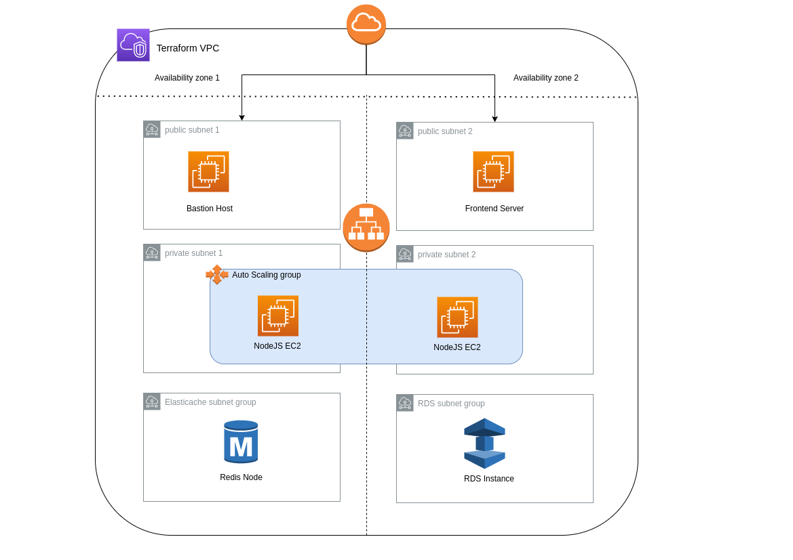

# A CI/CD Pipeline On AWS Platform Using Terraform & Jenkins

## Project's Description

- Project aim is to build a two CI/CD pipeline on a AWS Platform
- The first pipeline is for building the infrastructure
- The seconed pipeline is for building and deploying the nodeJS application
- Building a docker image from a nodejs application
- Using Dockerhub as our image repository to push the image to it

## Requirments

1. Linux os, Windows or Mac os  
2. A valid AWS account  
3. Docker to be installed on your machine 
4. Deploy jenkins as container on your machine  [ Setup ](https://davelms.medium.com/run-jenkins-in-a-docker-container-part-1-docker-in-docker-7ca75262619d) 


## Building Network infrastructure using terraform 

1. Creating a vpc 

2. Created four subnets (two puplic subnets & two private subnets) 

3. The bastion host is placed in a puplic subnet as it will later it will <br />
   be used as an ssh jump host to the jenkins slave

4. The nodeJS application server is deployed in one of the private subnets

5. Allowing the http and ssh inboud internet access to the public subents

6. Denying all inboud internet access to the private subents

7. Created a nat-gateway in order that my resources in the private subnets <br />
   can access the internet safely<br /> 



## Jenkins Setup Steps
1. After installing Docker on your local machine you need to run Jenkins as a container with <br />
   a mounted volume in order to presist your data in case the container goes down <br />
   ```
   [omar@localhost ~]$ docker run -d  -p 80:8080 \
    > --volume jenkins-data:/var/jenkins_home \
    > jenkins/jenkins:lts
   ```
2. Run the following command `docker exec [container-id] cat /var/jenkins_home/secrets/initialAdminPassword` <br />
   to get the initial admin password, copy it!

3. go to your browser then type `localhost:80` it should display a page stating the jenkins is starting <br />

4. Then it will ask for the admin password that you just copied <br />


5. Then click on `install recomended plugins` option


## Jenkins Configuration Steps

1. Install the `CloudBees AWS Credentials` plugin

2. restart jenkins after the installation is complete <br>
   Note that: <br />
   you have to start the container again manually by  <br />
   typing the command `docker start [container-id]`

3. Go to `Manage Jenkins| Manage Credentials | Add Credentials`
    * Kind:  `AWS Credentials`
    * Scope: `Global`
    * ID: `aws_cred`
    * Access Key ID: [your Access Key]
    * Secret Access Key: [your Secret Access Key]

4. Install terraform to in the Jenkins container [setup](https://learn.hashicorp.com/tutorials/terraform/install-cli)<br />

5. Adding pipline 
```
pipeline {
    agent any
    stages {
        stage('Building infra on AWS') {
            steps {
				withAWS(credentials:'aws_cred', region:'us-east-1'){
                sh 'echo hello'
                git 'https://github.com/OmarSolimanDev/Three-tier-infrastructure-on-AWS-using-Terraform.git'
				sh 'terraform -chdir=./Terraform-code/ init'    
				sh 'terraform -chdir=./Terraform-code/ apply --var-file dev.tfvars -auto-approve'
				    
				}
            }
            
        }
    }
}
```

   
## Author

[Omar Kamal ](https://www.linkedin.com/in/omar-soliman-617188208/)
